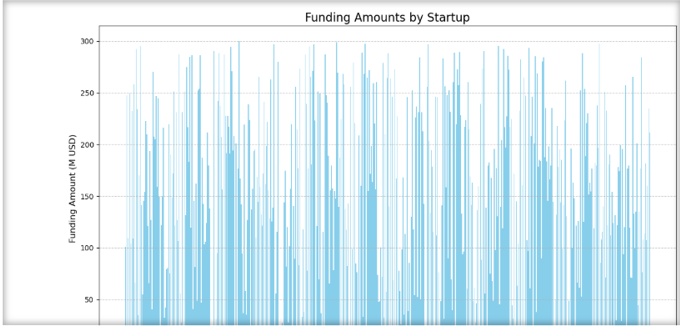

# Ex.No: 01A PLOT A TIME SERIES DATA
###  Date: 08/03/25

# AIM:
To Develop a python program to Plot a time series data (population/ market price of a commodity
/temperature.
# ALGORITHM:
1. Import the required packages like pandas and matplot
2. Read the dataset using the pandas
3. Calculate the mean for the respective column.
4. Plot the data according to need and can be altered monthly, or yearly.
5. Display the graph.
# PROGRAM:
```


import pandas as pd
import matplotlib.pyplot as plt

# Load the dataset
file_path = 'startup_data.csv'
data = pd.read_csv(file_path)

# Plot "Funding Amount (M USD)" by "Startup Name"
plt.figure(figsize=(12, 8))
plt.bar(data['Startup Name'], data['Funding Amount (M USD)'], color='skyblue')

# Set plot title and labels
plt.title('Funding Amounts by Startup', fontsize=16)
plt.xlabel('Startup Name', fontsize=12)
plt.ylabel('Funding Amount (M USD)', fontsize=12)
plt.xticks(rotation=90)  # Rotate startup names for better visibility
plt.grid(axis='y', linestyle='--', alpha=0.7)

# Show the plot
plt.tight_layout()  # Adjust layout to avoid clipping
plt.show()


```


# OUTPUT:




# RESULT:
Thus we have created the python code for plotting the time series of given data.
